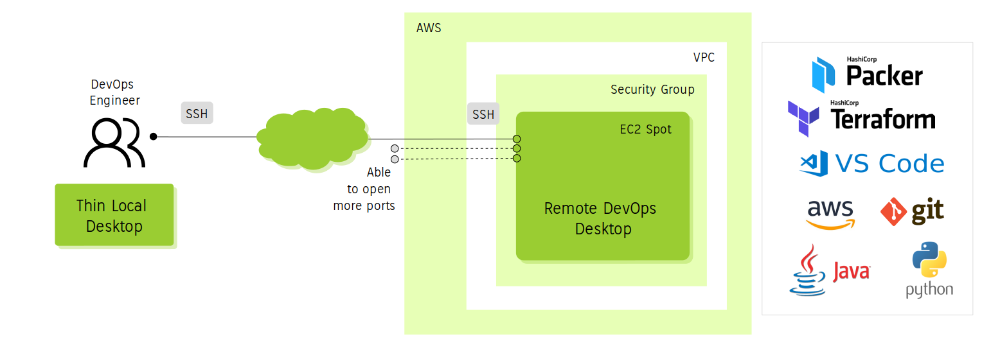

# BPM Processmaker on AWS 
Deployment and configuration of BPM ProcessMaker 4 on AWS.



## Resources

1. [ProcessMaker BPM Core](https://github.com/ProcessMaker/processmaker): ProcessMaker is an open source, workflow management software suite, which includes tools to automate your workflow, design forms, create documents, assign roles and users, create routing rules, and map an individual process quickly and easily. 
2. [AWS EC2](https://aws.amazon.com): Where ProcessMaker BPM Core will run. An AWS Account will be needed. 
3. [Terraform](https://www.terraform.io/): Terraform is an open-source infrastructure as code software tool that will help us to build and provision ProcessMaker on AWS.


## Steps

### Preparing

1. Install AWS CLI, Terraform CLI, configure your AWS credentials and generate SSH keys. 

```sh
$ wget -qN https://raw.githubusercontent.com/chilcano/how-tos/master/src/devops_tools_install_v3.sh \
        https://raw.githubusercontent.com/chilcano/how-tos/master/src/devops_tools_remove_v3.sh

$ chmod +x devops_tools_*.sh  
$ . devops_tools_install_v3.sh 
```

Once completed, run the next commands:
```sh
$ aws configure --profile DS

AWS Access Key ID [None]: AKIA...
AWS Secret Access Key [None]: 0ugi...
Default region name [None]: eu-west-2
Default output format [None]: 

$ export AWS_PROFILE=DS

$ source <(curl -s https://raw.githubusercontent.com/chilcano/how-tos/master/src/import_ssh_pub_key_to_aws_regions.sh)
...
=> SSH Pub Key was imported successfully to all AWS Regions in all AWS Profiles configured.
=> Now, you can use this command to get remote access:
   ssh ubuntu@<IP_ADDRESS> -i ~/.ssh/tmpkey
   ssh ubuntu@<FQDN> -i ~/.ssh/tmpkey
   ssh ubuntu@$(terraform output -json node_ips | jq -r '.[0]') -i ~/.ssh/tmpkey
   ssh ubuntu@$(terraform output node_fqdn) -i ~/.ssh/tmpkey

$ chmod -R 400  ~/.ssh/tmpkey*
```

### Terraform scripts

#### 1. Using Affordable EC2 instance

If you have cloned this repository [https://github.com/chilcano/bpm-processmaker-aws.git](https://github.com/chilcano/bpm-processmaker-aws.git), go to `resources/tf` directory and run the Terraform scripts.


__ToDo:__
* Ini vars
* Remote access


#### 2. Using Terraform Modules

1. Clone the [Hands-on-with-TLS](https://github.com/chilcano/Hands-on-with-TLS-Authentication-for-Microservices-Infra.git) repository and go to `02-processmaker/` dir, then run the next commands.

```sh
$ cd 02-processmaker/

$ terraform init

$ terraform validate

$ terraform plan

$ terraform apply
...
Apply complete! Resources: 10 added, 0 changed, 0 destroyed.

Outputs:

instances_workstation = [
  [
    "18.169.162.190",
  ],
]
```

2. Get remote access to the AWS Intance created.

Since we are using a Bitnami AMI image with latest Processmaker already configured, we should use the credentials that Bitnami provides us.

```sh
$ HOST_BPM_IP=$(terraform output -json instances_workstation | jq -r '.[][0]');  echo ${HOST_BPM_IP}

$ ssh bitnami@${HOST_BPM_IP} -i ~/.ssh/tmpkey
```

You should see this:
```sh
...
Debian GNU/Linux comes with ABSOLUTELY NO WARRANTY, to the extent
permitted by applicable law.
       ___ _ _                   _
      | _ |_) |_ _ _  __ _ _ __ (_)
      | _ \ |  _| ' \/ _` | '  \| |
      |___/_|\__|_|_|\__,_|_|_|_|_|
  
  *** Welcome to the ProcessMaker Community packaged by Bitnami 4.1.21-9 ***
  *** Documentation:  https://docs.bitnami.com/aws/apps/processmaker/    ***
  ***                 https://docs.bitnami.com/aws/                      ***
  *** Bitnami Forums: https://community.bitnami.com/                     ***
bitnami@ip-10-0-10-244:~$ 
```

3. Get the Application credentials.

Now, you would get the application credentials using the above ssh conexion:
```sh
bitnami@ip-10-0-10-244:~$ cat bitnami_credentials 
Welcome to the ProcessMaker Community packaged by Bitnami

******************************************************************************
The default username and password is 'user' and 'gml6EM9qiwTV'.
******************************************************************************

You can also use this password to access the databases and any other component the stack includes.

Please refer to https://docs.bitnami.com/ for more details.
```

Other way to get the Application credentials is through the AWS Console. Specificaly, go to `EC2 > Instances > Monitor and troubleshoot > Get system log`.
Further information here: https://docs.bitnami.com/aws/faq/get-started/find-credentials/

4. Accessing to BPM Processmaker Web UI

5. Cleaning up

```sh
$ terraform destroy

```


## Modeling Business Process

1. [Spanish - Modelando el Proceso de Compras con ProcessMaker, 2019/Oct](https://www.youtube.com/watch?v=JHtiRYgj2bY)
2. [Spanish - Modelando el Proceso de Solicitud de Ausencia, 2020/Oct](https://youtu.be/YLThe2JO5Do?list=PLcekSAwccnFbwfgJ0suNijp-wWQ422hVx&t=777)

## Other BPM tools to review

1. [BPMN-Moddle](https://github.com/bpmn-io/bpmn-moddle): Read and write BPMN 2.0 diagram files in NodeJS and the browser. BPMN-Moddle uses the BPMN 2.0 meta-model to validate the input and produce correct BPMN 2.0 XML.
2. [ProcessMaker Nayra](https://github.com/ProcessMaker/nayra): Nayra is a BPMN workflow engine in PHP. Utilize it in your own projects to have your own complex workflow capabilities. 
3. [ProcessMaker Modeler](https://github.com/ProcessMaker/modeler): Processmaker Modeler is a Vue.js based BPMN modeler scaffolded using [Vue CLI 3](https://cli.vuejs.org/).

